

  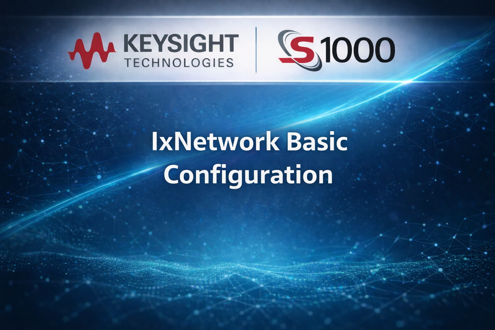

<h1 align="center">IxNetwork Basic Lab</h1>

## Table of Contents
- [Add Base Controls](#add-base-controls)
- [Configure Connectivity](#configure-connectivity)
- [Traffic](#traffic)

---

## Add Base Controls
1.  Add 2 ports in the new configuration.
2.  From scenario editor click on New Topology.

**Figure 1:** Add Topology

3. Select one port and click on Append Ports.

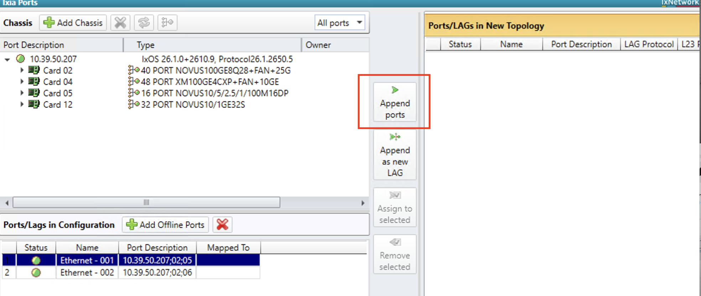

**Figure 2:** Append Ports

4. Port is appended, click on next.

**Figure 3:** Added Port

5. Select IPv6 from the list of protocols. Click Finish. 

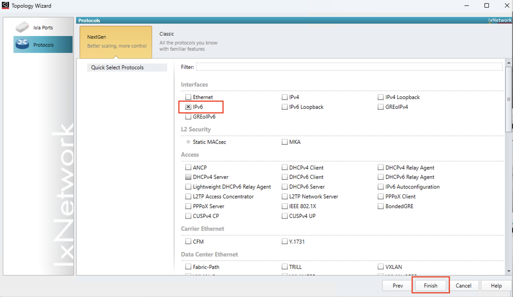

**Figure 4:** Add IPv6

6. This will add a topology with device group, where Ethernet and IPv6 Stacks are present. Double click on the name "Topology 1" and rename it to "Ingress".

**Figure 5:** Rename Topology

7. Click on New Toplogy button and repeat steps 3, 4, and 5 to add IPv6 to the second port. Rename the topology of second port as "Egress".

**Figure 6:** IPv6 Configuration Complete

---

## Configure Connectivity

8. Click on Ethrnet from the left panel and enable VLAN for all the devices. Now set VLAN value from 1 to 10, using increment pattern for both the ports.

**Figure 7:** Configure VLAN

9. Now click on the IPv6 from the left panel and set following IPv6 address:
   Egress:
    Device#1  - Address: aaaa::100, Gateway IP: aaaa::1
    ...
    Device#10 - Address: aaaa::109, Gateway IP: aaaa::a

  Ingress:
    Device#1  - Address: aaaa::1, Gateway IP: aaaa::100
    Device#10 - Address: aaaa::a, Gateway IP: aaaa::109

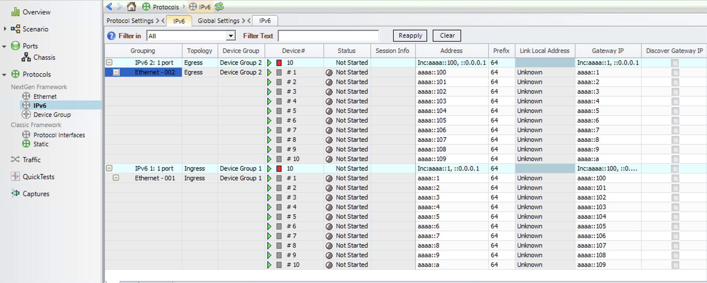

**Figure 8:** IPv6 Addresses

10. Start Protocols and see IPv6 is up.

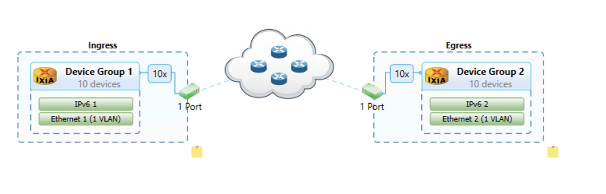

**Figure 9:** All Green

---

## Traffic

11. Now, from the left panel select traffic and add L2-3 Traffic Item.

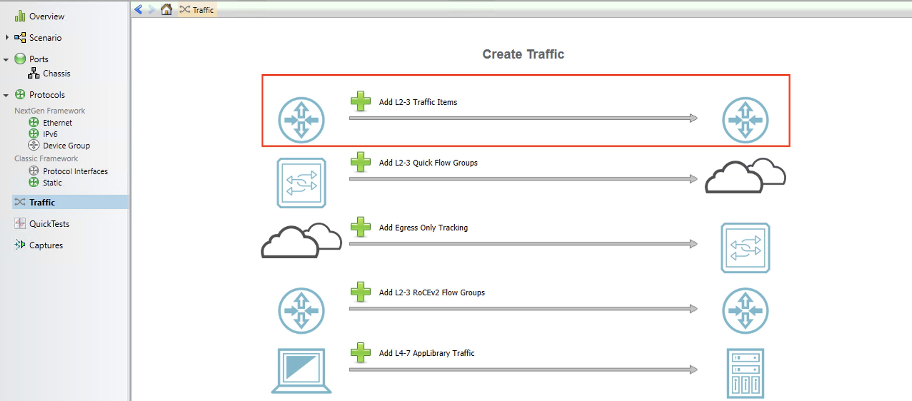

**Figure 10:** Add L2-3 Traffic Item

12. In this page -
    a. Select "Type of Traffic" as IPv6.
    b. Select Ingress as source of the traffic.
    c. Select Egress as destination of the traffic.
    d. Click on Next.

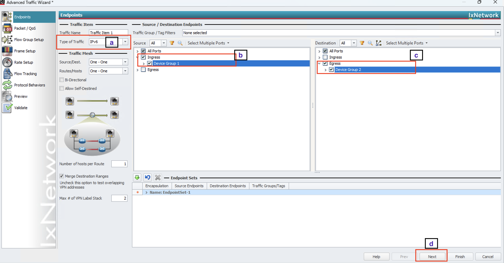

**Figure 11:** Endpoints Selection

13. From the left hand side navigation select Frame Setup, and choose any Framesize and payload type. You can continue with the default values also.

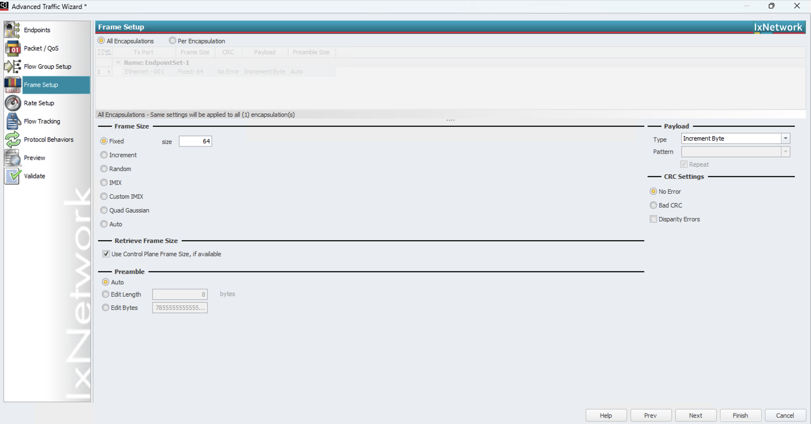

**Figure 12:** Frame Setup

14. Similarly, from the left pane select the Rate Setup, and choose any appropriate value. You can continue with the default values.

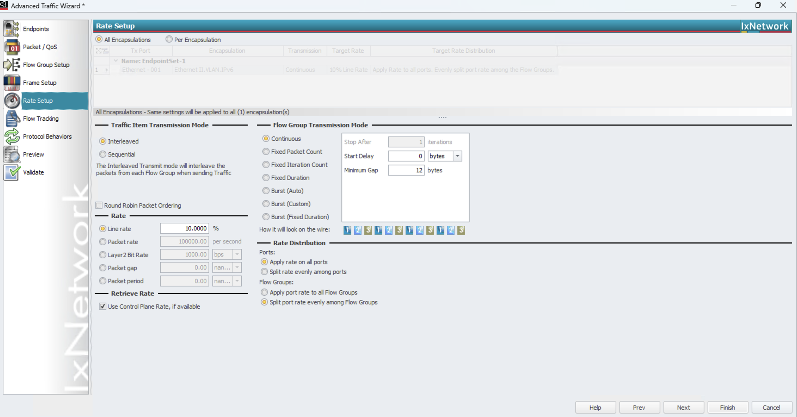

**Figure 13:** Rate Setup

15. From the left pane come to Flow Tracking. Choose VLAN: VLAN-ID for this lab. You are free to choose any other option. In the flow statistics, the stats will be tracked based on this selection. After this click on Finish.

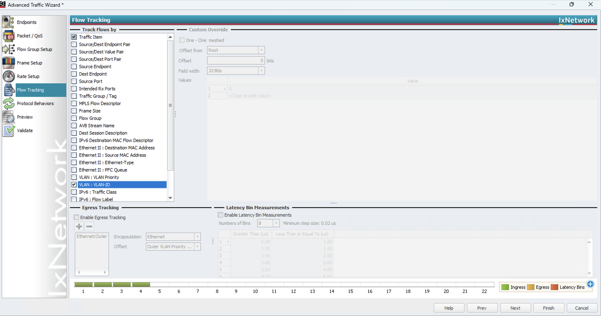

**Figure 14:** Flow Tracking

16. Following flow group will be created.

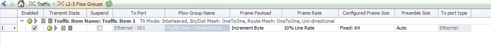

**Figure 15:** Flow group

17. Now, first apply the traffic, then start the traffic. Options are available as shown in the following picture.

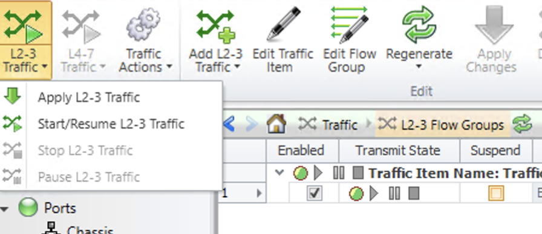

**Figure 16:** Apply and Start

18. From flow statistics, you can check the stats. Note that the stats are tracked by VLAN ID (colored in Yellow).

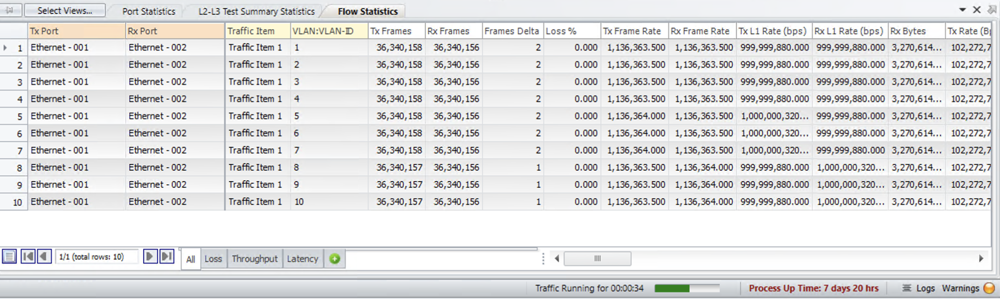

**Figure 17:** Flow Statistics

---

**End of Document**
