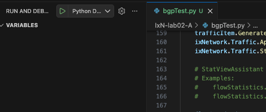

# IxN-lab02-A Instructions

<h1 align="center">Automate end to end BGP test</h1>

## Overview

This lab uses IxNetwork-restpy  to control the IxNetwork application. Please use your allocated IxNetwork web ui instance. 

## Deployment

In this lab you will use an exisiting session in your IxNetwork web ui client that you used for the previous lab. 
* Rename you IxNetwork session like this "yourname-S1000"
* Make sure the session is open before you run the script
* You will need a python environment to run the test (script). 
    * if you have your VS code setup use it to run and debug. You can use break points to understand workflow
    * You can also use you Linux VM for this exercise. 

## Prerequisites

Install IxNetwork-restpy
```Shell
python3 -m pip install --upgrade ixnetwork-restpy
```
Clone this repo if you have not already
```Shell
git clone https://github.com/isgmano/training.git
```
Navigate to script directory and open in in VSCode or IDE or use vi in Linux
```Shell
cd cd ~/training/IxN-lab02-A/
vi bgpTest.py
```
If you are using VSCode) in the lines 79, 106, 134, 143, 168
Start the execution in debug mode


If you are using Linux VM:
```Shell
python3 bgpTest.py
```
If running on VS Code at each breakpoint inspect the configuration in web UI. 
Look at script watch to see the REST API trace. 

Optional:
Modify script to change the configuration. 
Use Bulk operations to build a scaled config by modifying the script. 

