<p align="center">
  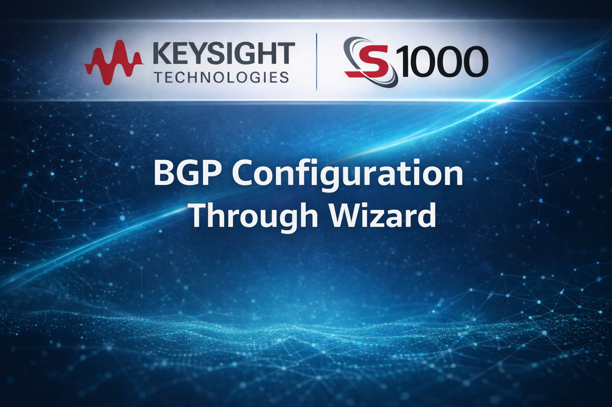
</p>

<h1 align="center">BGP Configuration Through Wizard</h1>

---

## Table of Contents

- [Connect to the IxNetwork Web](#connect-to-the-ixnetwork-web)
- [Configure Base Configuration](#configure-base-configuration)
- [Configure Connectivity](#configure-connectivity)
- [Learned Information](#learned-information)
- [Traffic and Statistics](#traffic-and-statistics)

---

## Connect to the IxNetwork Web

1. Open a browser and navigate to:

   ```text
   https://<chassis>/ixnetworkweb
   ```

2. Log in using valid credentials.
3. Click **New Session** for IxNetwork.

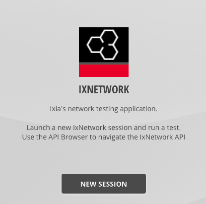

**Figure 1:** IxNetwork New Session

---

## Configure Base Configuration

### Landing Page Overview

On the landing page:

- **Section [1]** – Controls to add protocols, traffic, or run the wizard
- **Section [2]** – Options to quickly create configurations
- **Section [3]** – Recently saved configuration files


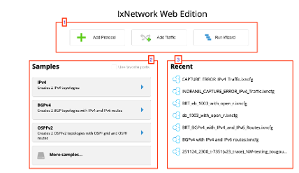

**Figure 2:** Landing Page

### File Control

The **File Control** menu allows operations such as:

- Save configuration
- Open configuration
- Start wizards


**Figure 3:** File Control

### Launching the Wizard

You can open the wizard using either method:

- **File Control → Wizards**
- **Run Wizard** from the landing page

Both options open the same wizard interface.

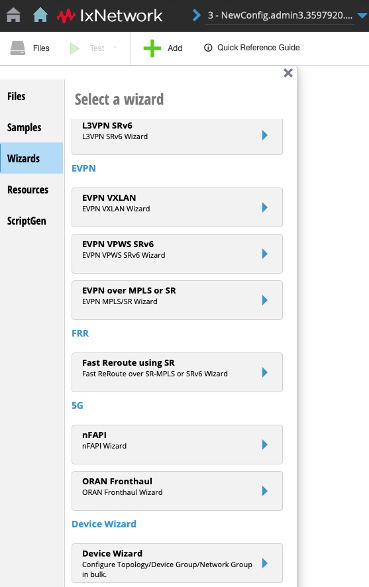

**Figure 4:** Wizard

### Device Wizard – Step 1

1. Select **DeviceGroups to be added to new topologies**.
2. All other options are automatically disabled.
3. Click **Next**.

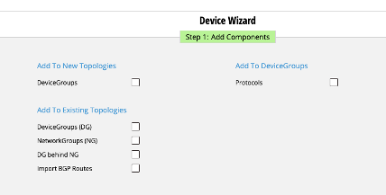

**Figure 5:** Wizard Step 1

### Wizard – Step 2 (Topology Configuration)

Configure the fields as follows:

- **Number of Topologies:** 2
- **Topology Prefix Name:** `AS100`
- **Multiplier:** 1
- **DeviceGroup Prefix Name:** `BGP`

Click **Next** to continue.

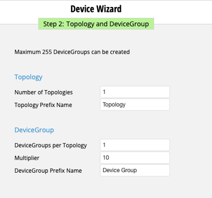

**Figure 6:** Wizard Step 2

### Protocol Selection

1. From the protocol list, select **BGP**.
2. Use the **Filter** text box if needed.
3. Click **Next**.

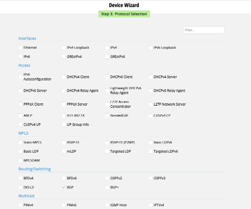

**Figure 7:** Protocol Selection

### Interface Configuration

- Leave all settings at their default values.
- If auto-generation is disabled, manually configure addresses as required.
- Click **Next**.

### Summary and Finish

1. Enable **Summary**.
2. Review the configuration.
3. Click **Finish**.

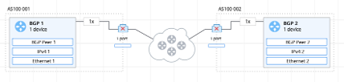

**Figure 8:** Creation of Topologies

---

## Configure Connectivity

### IPv4 Configuration

#### Topology 1

- **IP Address:** `20.20.20.10`
- **Gateway:** `20.20.20.20`

#### Topology 2

- **IP Address:** `20.20.20.20`
- **Gateway:** `20.20.20.10`

### BGP Peer Configuration

- **BGP Peer 1**
  - DUT IP: `20.20.20.20`
- **BGP Peer 2**
  - DUT IP: `20.20.20.10`

### Enable Learned Routes Filter

For both BGP peers:

1. Open **Learned Routes Filters**.
2. Enable **Filter IPv4 Unicast**.

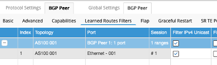

**Figure 9:** Enable Learned Filter

### Adding Network Groups

1. Select **BGP Peer 1**.
2. Click **Add** to add a network group.
3. Choose **IPv4 Addresses**.
4. Select **Append**.
5. Repeat these steps for **BGP Peer 2**.

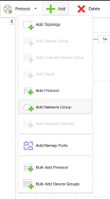

**Figure 10:** Adding a Network Group

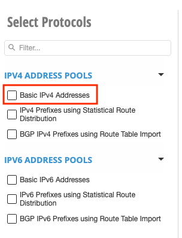

**Figure 11:** Basic IPv4 Addresses

### Port Mapping and Test Start

1. Use **Add/Remap Ports** to assign ports to the topology.
2. Connect all mapped ports.
3. Start the test via **Test → Start**.
4. Verify that all protocols are operational.

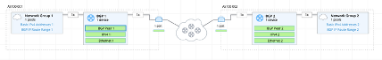

**Figure 12:** All Green

---

## Learned Information

### Fetch Learned Information

1. Click **Action**.
2. Select **BGP Peer Get Non-VPN Learned Info**.

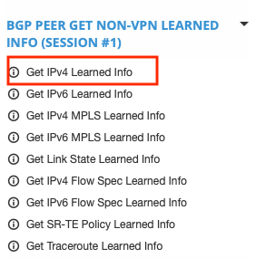

**Figure 13:** Fetch Learned Info

The learned BGP routing information is displayed.

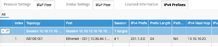

**Figure 14:** Learned Information on BGP Peer 1

---

## Traffic and Statistics

### Add Traffic Item

1. Click **Traffic**.
2. Select **Add Traffic Item**.

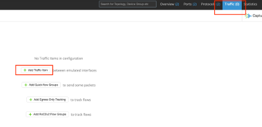

**Figure 15:** Traffic Addition

### Traffic Configuration

1. Select **IPv4** as the traffic type.
2. Choose the **Source Endpoint**.
3. Choose the **Destination Endpoint**.
4. Click **New Traffic Item**.

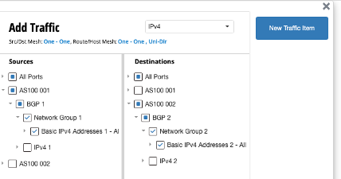

**Figure 16:** Endpoint Selection

A new traffic item is created.

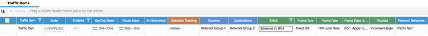

**Figure 17:** Traffic Item

### Run Traffic and View Statistics

1. Start traffic.
2. Open **Port Statistics** to verify frame transfer.

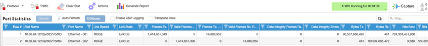

**Figure 18:** Port Stats

### Enable Statistics Tracking

1. Stop traffic.
2. Return to the traffic item.
3. In **Statistics Tracking**, select **Dest Endpoint**.

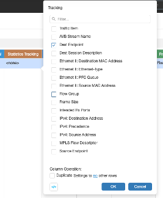

**Figure 19:** Enable Stats Tracking

### Flow Statistics

1. Start traffic again.
2. Navigate to **Statistics → Flow Statistics**.
3. Review detailed traffic metrics.

---

**End of Document**
