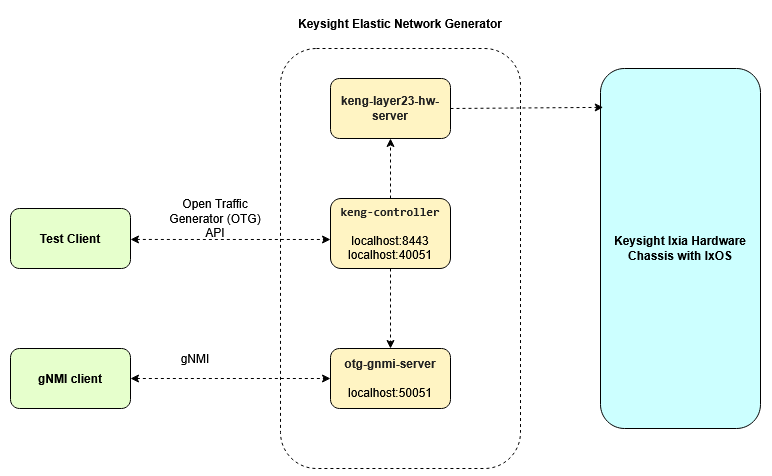
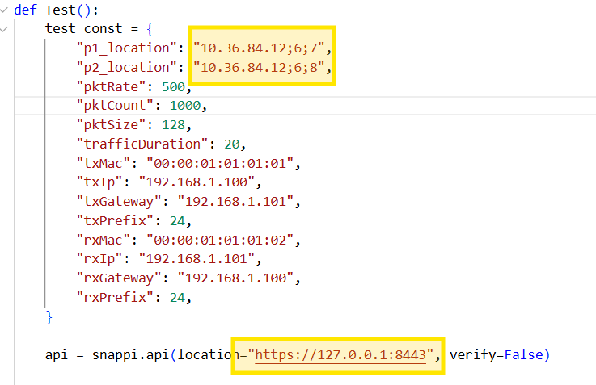
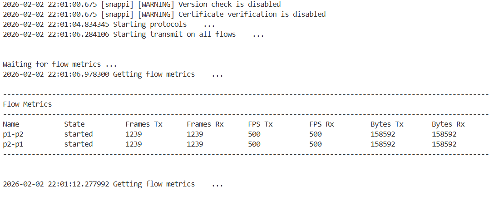
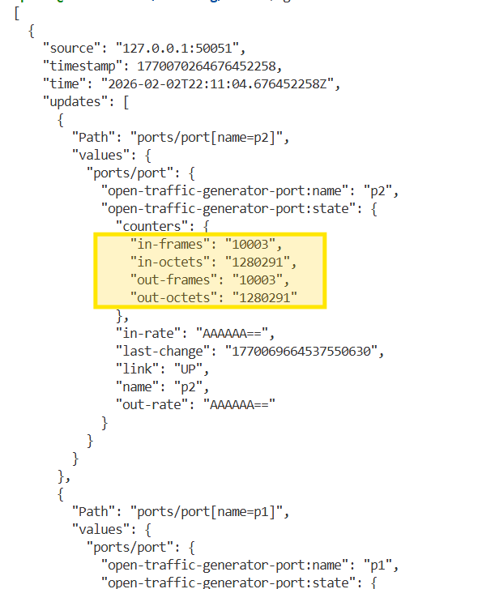

# Lab 03 Instructions

## Overview

This lab uses [snappi](https://github.com/open-traffic-generator/snappi) to control the hardware ports of a Keysight chassis. OTG configs are supported on Novus, Ares and IxVM ports.
Any [IxOS Hardware test](https://ixia-c.dev/tests-chassis-app/) will require a KENG System license so the license server will be passed to the KENG controller during 
deployment. More information about the licensing can be found [here](https://ixia-c.dev/licensing/)



## Deployment

Let's deploy the 3 containers. We will be using docker compose, which will automatically download the required images if not present in the local registry.
Let's open the `compose.yml` file and analyze its content. Notice the dependencies between the containers and the presence of the license server parameter.

```Shell
cd ~/training/lab-03 && docker compose up -d
```

At this point the 3 containers should be running. Please check the status.
```Shell
docker ps
```

## Execution

Every user should have received a chassis with at least 2 OTG capable ports. We will open the test and provide the location for the controller and the 2 OTG ports.

```Shell
cd ~/training/lab-03 && vim lab-03.py
```

Observe the controller location and the two traffic engine locations used as otg ports. Modify the location to match your assignments.



Run the test script

```Shell
python3 lab-03.py
```


otg-gnmi-server container is used for metrics. We can retrieve any statistics or states.
Let's install gnmi client [gnmic](https://github.com/openconfig/gnmic)

```Shell
bash -c "$(curl -sL https://get-gnmic.openconfig.net)"
```

Let's get some port and flow stats

```Shell
gnmic -a 127.0.0.1:50051 --skip-verify -u admin -p admin get --path "ports"
gnmic -a 127.0.0.1:50051 --skip-verify -u admin -p admin get --path "flows"
```


Let's get the ARP tables

```Shell
gnmic -a 127.0.0.1:50051 --skip-verify -u admin -p admin get --path "interfaces"
```


## Cleanup

Stop and remove the previously created containers. 

```Shell
cd ~/training/lab-03 && docker compose down
```


